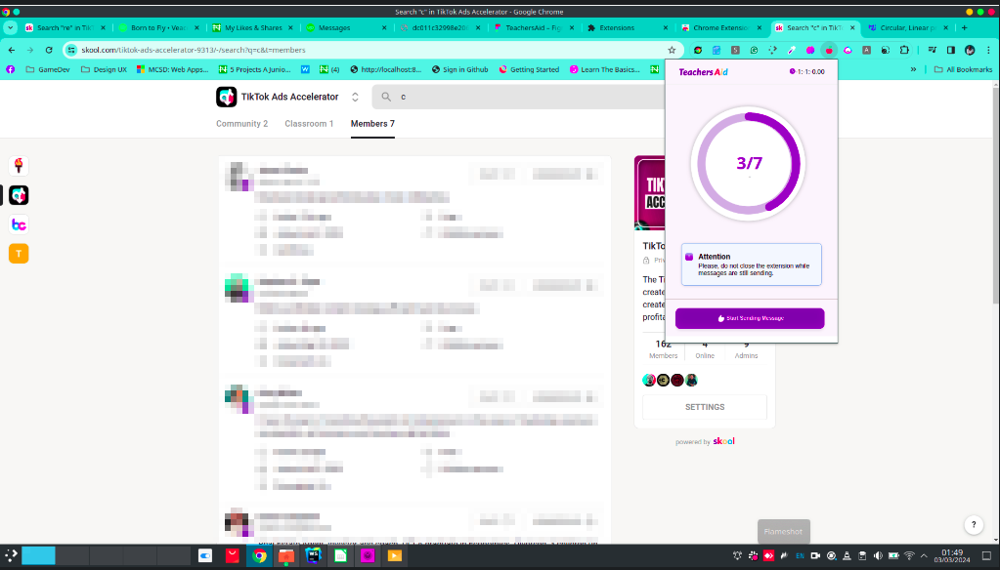
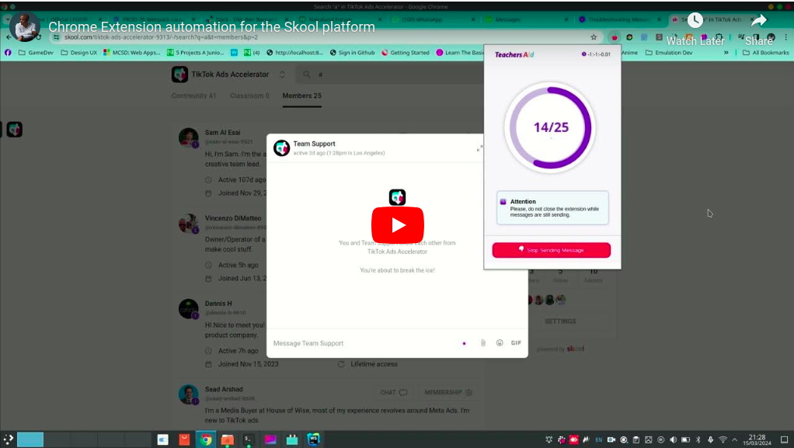

## Skool Platform

I developed an extension for the Skool platform that allows users to send mass messages. The extension was built using Chrome extension, React, and TypeScript. By injecting scripts, the extension is able to read the response from the host page to obtain an id, which is then used to send messages to members. This process enables efficient communication with multiple users on the Skool platform.


## Installation

Run the following command to install the necessary dependencies:

```npm install```

## Usage

To run the extension, use the following command:

```npm run start```

### Folder Structure

The extension is structured as follows:

* background.ts: Contains the background script that listens for messages from the content script and popup script.

* components: Contains the React components for the popup.
* options: Contains the options page for the extension.
* popup: Contains the popup page for the extension.
* skool: Contains the content script that is injected into the Skool platform and also logic for the Skool platform.
* zustand: Contains the global state management for the extension.
* constants.ts: Contains the constants used in the extension. e.g Storage keys.

### Screenshots




Youtube Link: https://youtu.be/XSxDi8YtBEk


